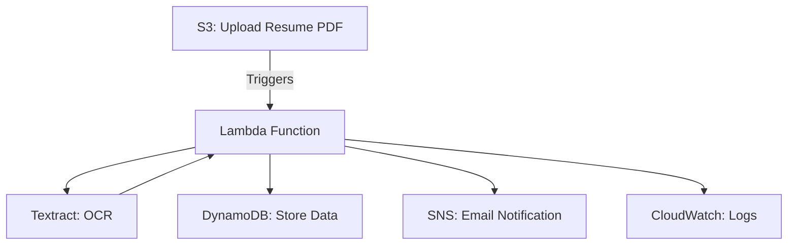

# Serverless-Resume-Parser

Hey there! 👋

Welcome to my Serverless Resume Parser project. I built this because I was tired of manually digging through resumes—so I figured, why not let AWS do the heavy lifting? This project lets you upload a PDF resume to S3, then automatically extracts the important stuff (like name, skills, education) using AWS Lambda and Textract. The results go into DynamoDB, and you'll get an email notification when it's done. Plus, everything's logged in CloudWatch so you can see what's happening under the hood.

---

## 📝 Project Story & Real-World Motivation

In the first version of this project, I took a local-first approach: drop a PDF resume into a folder, run a Python script, and save the extracted text to a file using AWS Textract. It was a great way to get hands-on with Textract and see what it could do—but let's be honest, it was all pretty manual.

This project isn't about perfection. It's about learning, experimenting, and getting real with AWS services.

For this next step, I wanted to see how this could work in a real backend environment. That meant introducing automation, event triggers, and cloud storage. The goal? Automate the entire resume parsing flow using serverless AWS tools.

> 📌 **Note:** The PDF upload is still manual here (just drag and drop into S3), but everything after that—processing, extraction, storage—is fully automated. In production, uploads would be handled by apps or devices, but for this demo, I kept it simple.

### ⚙️ What's Automated?

- **Amazon S3**: Acts as the dropzone for resumes and triggers the workflow.
- **AWS Lambda**: Extracts content from PDFs using Textract.
- **Amazon DynamoDB**: Stores structured resume data.
- **CloudWatch Logs**: Tracks the whole process for easy debugging.
- **IAM Roles**: Make sure everything talks to each other securely.

The result? A lightweight, event-driven backend that reacts to new resumes and processes them automatically— scripts to run, no manual parsing.

### 🏢 Why Automate Resume Processing?

In fields like HR, healthcare, and legal, documents arrive as PDFs—resumes, forms, contracts. Manually reading and entering data is slow, error-prone, and impossible to scale. Automation turns these static files into event-driven inputs: as soon as a resume lands in S3, the backend extracts key fields, stores them in DynamoDB, and makes them available for search, analysis, or alerts.

This project is a hands-on demo of how AWS can bridge the gap between unstructured input and structured output. What used to take minutes per file now happens in seconds, with zero manual effort (after upload).

---

## 🎥 Demo Videos

Want to see it in action? Check out the `demo_videos` folder for walkthroughs and real-world examples of the workflow from upload to database entry.

---

## 🧠 Lessons Learned

- **Lambda Timeouts**: Textract can take a while—plan for longer Lambda timeouts.
- **Parsing Gotchas**: Not all resumes are perfectly formatted. Add logic to skip or handle incomplete entries.
- **IAM Permissions**: Full-access policies are fine for demos, but always use least privilege in production.

---

## 🗺️ Architecture Overview

Here's how the serverless resume parser works at a high level:

- **IAM**: Secure roles and permissions for Lambda ([docs](https://docs.aws.amazon.com/IAM/latest/UserGuide/introduction.html))
- **S3**: PDF upload triggers Lambda ([docs](https://docs.aws.amazon.com/s3/index.html))
- **Lambda**: Uses Textract for OCR, parses resume, stores data in DynamoDB, sends SNS notifications ([docs](https://docs.aws.amazon.com/lambda/latest/dg/welcome.html))
- **DynamoDB**: Stores parsed resume data ([docs](https://docs.aws.amazon.com/dynamodb/index.html))
- **CloudWatch**: Logs and monitors Lambda execution ([docs](https://docs.aws.amazon.com/cloudwatch/index.html))
- **SNS**: Email notifications on new resume uploads ([docs](https://docs.aws.amazon.com/sns/index.html))

---

## 📚 Resources
- [Interactive Setup & Deployment Instructions](./INSTRUCTIONS.md)
- [AWS Lambda Docs](https://docs.aws.amazon.com/lambda/latest/dg/welcome.html)
- [Amazon Textract Docs](https://docs.aws.amazon.com/textract/latest/dg/what-is.html)
- [Amazon S3 Docs](https://docs.aws.amazon.com/s3/index.html)
- [Amazon DynamoDB Docs](https://docs.aws.amazon.com/dynamodb/index.html)
- [Amazon SNS Docs](https://docs.aws.amazon.com/sns/index.html)

---

*Need more help? Open an issue or check the [AWS documentation](https://docs.aws.amazon.com/).*
