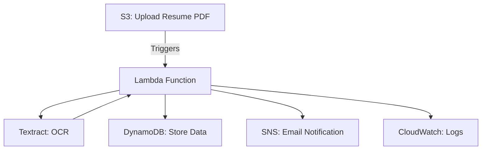

# Serverless-Resume-Parser

Hey there! 👋

Welcome to my Serverless Resume Parser project. I built this because I was tired of manually digging through resumes—so I figured, why not let AWS do the heavy lifting? This app lets you upload a PDF resume to S3, then automatically extracts the important stuff (like name, skills, education) using AWS Lambda and Textract. The results go into DynamoDB, and you'll get an email notification when it's done. Plus, everything's logged in CloudWatch so you can see what's happening under the hood.

---

## 📝 Project Story & Real-World Motivation

In the first version of this project, I took a local-first approach: drop a PDF resume into a folder, run a Python script, and save the extracted text to a file using AWS Textract. It was a great way to get hands-on with Textract and see what it could do—but let's be honest, it was all pretty manual.

This project isn't about perfection. It's about learning, experimenting, and getting real with AWS services.

For this next step, I wanted to see how this could work in a real backend environment. That meant introducing automation, event triggers, and cloud storage. The goal? Automate the entire resume parsing flow using serverless AWS tools.

> 📌 Note: The PDF upload is still manual here (just drag and drop into S3), but everything after that—processing, extraction, storage—is fully automated. In production, uploads would be handled by apps or devices, but for this demo, I kept it simple.

### ⚙️ What's Automated?

- **Amazon S3**: Acts as the dropzone for resumes and triggers the workflow.
- **AWS Lambda**: Extracts content from PDFs using Textract.
- **Amazon DynamoDB**: Stores structured resume data.
- **CloudWatch Logs**: Tracks the whole process for easy debugging.
- **IAM Roles**: Make sure everything talks to each other securely.

The result? A lightweight, event-driven backend that reacts to new resumes and processes them automatically—no scripts to run, no manual parsing.

### 🏢 Why Automate Resume Processing?

In fields like HR, healthcare, and legal, documents arrive as PDFs—resumes, forms, contracts. Manually reading and entering data is slow, error-prone, and impossible to scale. Automation turns these static files into event-driven inputs: as soon as a resume lands in S3, the backend extracts key fields, stores them in DynamoDB, and makes them available for search, analysis, or alerts.

This project is a hands-on demo of how AWS can bridge the gap between unstructured input and structured output. What used to take minutes per file now happens in seconds, with zero manual effort (after upload).

---

## 🛠️ Step-by-Step Implementation

Here's a quick walkthrough of how I set things up, in the order I tackled each piece. Nothing overly complex—just enough to get a fully working flow from upload to database entry.

1. **S3 Setup — Upload as a Trigger**
   - Created an S3 bucket to act as the dropzone for incoming PDFs. Every time a file is uploaded, it automatically triggers the next step.
   - Added an S3 event trigger to my Lambda function (ObjectCreated event).
   - ⚠️ In production, you'd usually narrow this to a folder or file type filter. For now, keeping it wide open helped test faster.

2. **Lambda Function — Extract and Parse on the Fly**
   - Lambda pulls the PDF from S3, sends it to Textract, parses the returned lines into structured fields, and stores each parsed record into DynamoDB.
   - Used the `detect_document_text` API for fast, synchronous extraction.
   - For more complex docs, you could use Textract's other operations.

3. **Textract Output Processing — Turning Lines Into Records**
   - Textract returns blocks of text as separate lines. I looped through each line and looked for patterns like Name:, Skills:, Education: etc.
   - Whenever a new Name appeared, I considered that the start of a new record.
   - The format of your source PDF matters—a lot! If you're working with messy scans, you'll likely need a smarter parser.

4. **DynamoDB Storage — Saving Each Record**
   - Each parsed record is stored as a new item in DynamoDB.
   - Used a unique ID as the partition key, and skipped any record that didn't include it.

5. **Monitoring with CloudWatch Logs**
   - Every step—from event trigger to Textract response to final record insert—is logged automatically in CloudWatch Logs.
   - Super helpful for debugging and validation.

6. **IAM Roles — Permissions That Make It Work**
   - Created an IAM role for the Lambda function with all the right policies.
   - In real-world scenarios, always follow the principle of least privilege.

---

## 🎥 Demo Videos

Want to see it in action? Check out the `demo_videos` folder for walkthroughs and real-world examples of the workflow from upload to database entry.

---

## 🧠 Lessons Learned

- **Lambda Timeouts**: Textract can take a while—plan for longer Lambda timeouts.
- **Parsing Gotchas**: Not all resumes are perfectly formatted. Add logic to skip or handle incomplete entries.
- **IAM Permissions**: Full-access policies are fine for demos, but always use least privilege in production.

---

## 🚀 Quick Start

- [ ] [Check out the Interactive Setup Guide](./INSTRUCTIONS.md)


- **IAM**: Secure roles and permissions for Lambda
- **S3**: PDF upload triggers Lambda
- **Lambda**: Uses Textract for OCR, parses resume, stores data in DynamoDB, sends SNS notifications
- **DynamoDB**: Stores parsed resume data
- **CloudWatch**: Logs and monitors Lambda execution
- **SNS**: Email notifications on new resume uploads

---

## 🧠 Lambda Function Logic

1. Triggered by S3 upload
2. Uses Textract to extract text from PDF
3. Parses for name, skills, and education
4. Stores parsed data in DynamoDB
5. Sends SNS notification
6. Logs all steps for monitoring

> ⚠️ **Note:** Replace `<your-account-id>` in the Lambda code with your actual AWS account ID for SNS notifications.

---

<details>
<summary>❓ <strong>FAQ & Troubleshooting (click to expand)</strong></summary>

### ✅ 1. Textract AccessDeniedException
**Error Message:**
```
User is not authorized to perform: textract:DetectDocumentText
```
**Solution:**
- Attach the `AmazonTextractFullAccess` policy to the Lambda's execution role.
- Verify the role is linked under Lambda's "Configuration > Permissions" tab.

---

### ✅ 2. Textract InvalidS3ObjectException
**Error Message:**
```
Unable to get object metadata from S3. Check object key, region and/or access permissions.
```
**Solution:**
- Ensure S3 bucket and Lambda are in the same region (`us-east-1`).
- Give `s3:GetObject` permission to the Lambda role.
- Make sure the file is uploaded correctly and accessible in S3.

---

### ✅ 3. Lambda Timeout or Textract Endpoint Error
**Error Message:**
```
Textract failed: Could not connect to the endpoint URL
```
**Solution:**
- Use a region that supports Textract (e.g., `us-east-1`).
- Make sure all services are in the same region.

---

### ✅ 4. No Output in DynamoDB Table
**Symptoms:**
- Resume uploaded to S3, logs printed resume data, but no data in DynamoDB.
**Solution:**
- Ensure table name in Lambda matches DynamoDB table.
- Use `ResumeID` as the partition key.
- Log resume data before inserting for debugging.

---

### ✅ 5. CloudWatch Logs Not Visible
**Symptoms:**
- Lambda triggered but no logs in CloudWatch.
**Solution:**
- Attach `AWSLambdaBasicExecutionRole` or `CloudWatchLogsFullAccess` to Lambda's IAM role.
- Add `print()` and logging statements in Lambda.

---

### ✅ 6. SNS Emails Not Delivered
**Solution:**
- Confirm the SNS subscription via the email link.
- Resend confirmation if missed.

</details>

---

## 📚 Resources
- [Interactive Setup & Deployment Instructions](./INSTRUCTIONS.md)
- [AWS Lambda Docs](https://docs.aws.amazon.com/lambda/latest/dg/welcome.html)
- [Amazon Textract Docs](https://docs.aws.amazon.com/textract/latest/dg/what-is.html)
- [Amazon S3 Docs](https://docs.aws.amazon.com/s3/index.html)
- [Amazon DynamoDB Docs](https://docs.aws.amazon.com/dynamodb/index.html)
- [Amazon SNS Docs](https://docs.aws.amazon.com/sns/index.html)

---

*Need more help? Open an issue or check the [AWS documentation](https://docs.aws.amazon.com/).*
