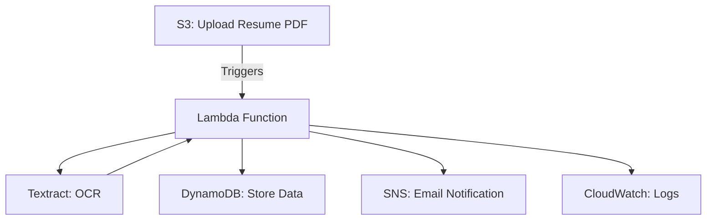

# Serverless-Resume-Parser

Hey there! 👋

Welcome to my Serverless Resume Parser project. I built this because I was tired of manually digging through resumes—so I figured, why not let AWS do the heavy lifting? This app lets you upload a PDF resume to S3, then automatically extracts the important stuff (like name, skills, education) using AWS Lambda and Textract. The results go into DynamoDB, and you'll get an email notification when it's done. Plus, everything's logged in CloudWatch so you can see what's happening under the hood.

---

## 🤔 Why I Built This

I wanted a hands-off way to process resumes for side projects and hackathons, and I thought it'd be fun to learn more about AWS's serverless tools. If you're looking for a simple, scalable way to parse resumes (or just want to see how all these AWS services fit together), you're in the right place!

---

## 🚀 Quick Start

- [ ] [Check out the Interactive Setup Guide](./INSTRUCTIONS.md)


- **IAM**: Secure roles and permissions for Lambda
- **S3**: PDF upload triggers Lambda
- **Lambda**: Uses Textract for OCR, parses resume, stores data in DynamoDB, sends SNS notifications
- **DynamoDB**: Stores parsed resume data
- **CloudWatch**: Logs and monitors Lambda execution
- **SNS**: Email notifications on new resume uploads

---

## 🧠 Lambda Function Logic

1. Triggered by S3 upload
2. Uses Textract to extract text from PDF
3. Parses for name, skills, and education
4. Stores parsed data in DynamoDB
5. Sends SNS notification
6. Logs all steps for monitoring

> ⚠️ **Note:** Replace `<your-account-id>` in the Lambda code with your actual AWS account ID for SNS notifications.

---

<details>
<summary>❓ <strong>FAQ & Troubleshooting (click to expand)</strong></summary>

### ✅ 1. Textract AccessDeniedException
**Error Message:**
```
User is not authorized to perform: textract:DetectDocumentText
```
**Solution:**
- Attach the `AmazonTextractFullAccess` policy to the Lambda's execution role.
- Verify the role is linked under Lambda's "Configuration > Permissions" tab.

---

### ✅ 2. Textract InvalidS3ObjectException
**Error Message:**
```
Unable to get object metadata from S3. Check object key, region and/or access permissions.
```
**Solution:**
- Ensure S3 bucket and Lambda are in the same region (`us-east-1`).
- Give `s3:GetObject` permission to the Lambda role.
- Make sure the file is uploaded correctly and accessible in S3.

---

### ✅ 3. Lambda Timeout or Textract Endpoint Error
**Error Message:**
```
Textract failed: Could not connect to the endpoint URL
```
**Solution:**
- Use a region that supports Textract (e.g., `us-east-1`).
- Make sure all services are in the same region.

---

### ✅ 4. No Output in DynamoDB Table
**Symptoms:**
- Resume uploaded to S3, logs printed resume data, but no data in DynamoDB.
**Solution:**
- Ensure table name in Lambda matches DynamoDB table.
- Use `ResumeID` as the partition key.
- Log resume data before inserting for debugging.

---

### ✅ 5. CloudWatch Logs Not Visible
**Symptoms:**
- Lambda triggered but no logs in CloudWatch.
**Solution:**
- Attach `AWSLambdaBasicExecutionRole` or `CloudWatchLogsFullAccess` to Lambda's IAM role.
- Add `print()` and logging statements in Lambda.

---

### ✅ 6. SNS Emails Not Delivered
**Solution:**
- Confirm the SNS subscription via the email link.
- Resend confirmation if missed.

</details>

---

## 📚 Resources
- [Interactive Setup & Deployment Instructions](./INSTRUCTIONS.md)
- [AWS Lambda Docs](https://docs.aws.amazon.com/lambda/latest/dg/welcome.html)
- [Amazon Textract Docs](https://docs.aws.amazon.com/textract/latest/dg/what-is.html)
- [Amazon S3 Docs](https://docs.aws.amazon.com/s3/index.html)
- [Amazon DynamoDB Docs](https://docs.aws.amazon.com/dynamodb/index.html)
- [Amazon SNS Docs](https://docs.aws.amazon.com/sns/index.html)

---

*Need more help? Open an issue or check the [AWS documentation](https://docs.aws.amazon.com/).*
