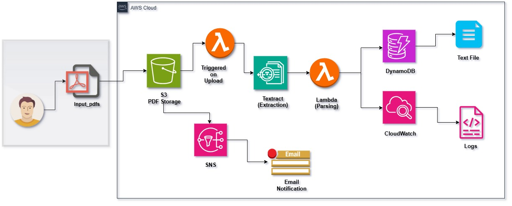
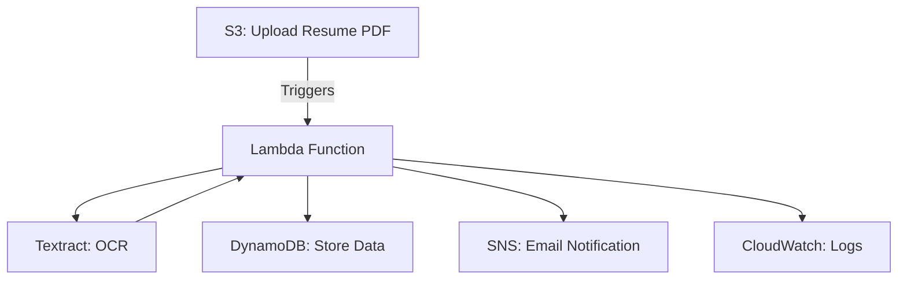

# Serverless-Resume-Parser

Hey there!

Welcome to my Serverless Resume Parser project. I built this because I was tired of manually digging through resumes—so I figured, why not let AWS do the heavy lifting? This project lets you upload a PDF resume to S3, then automatically extracts the important stuff (like name, skills, education) using AWS Lambda and Textract. The results go into DynamoDB, and you'll get an email notification when pdf is uploaded to the S3 bucket. Plus, everything's logged in CloudWatch so you can see what's happening under the hood.

---

## Features
- Upload PDF resumes to S3 and trigger automatic parsing
- Extracts name, email, phone, education, skills, projects, experience, and certifications
- Stores structured data in DynamoDB
- Sends email notifications via SNS
- All activity is logged in CloudWatch for easy debugging
- Fully serverless and scalable

---

## Project Story & Real-World Motivation

In the first version of this project, I took a local-first approach: drop a PDF resume into a folder, run a Python script, and save the extracted text to a file using AWS Textract. It was a great way to get hands-on with Textract and see what it could do—but let's be honest, it was all pretty manual.

This project isn't about perfection. It's about learning, experimenting, and getting real with AWS services.

For this next step, I wanted to see how this could work in a real backend environment. That meant introducing automation, event triggers, and cloud storage. The goal? Automate the entire resume parsing flow using serverless AWS tools.

> **Note:** The PDF upload is still manual here (just drag and drop into S3), but everything after that—processing, extraction, storage—is fully automated. In production, uploads would be handled by apps or devices, but for this demo, I kept it simple.

---

## How It Works
1. Upload a PDF resume to the S3 bucket.
2. S3 triggers the Lambda function.
3. Lambda uses Textract to extract text from the PDF.
4. The function parses out key fields (name, email, skills, etc.).
5. Parsed data is stored in DynamoDB.
6. An SNS notification is sent to your email.
7. All steps are logged in CloudWatch for monitoring and debugging.

---

## Architecture Overview

Here's how the serverless resume parser works at a high level:

- **IAM**: Secure roles and permissions for Lambda ([docs](https://docs.aws.amazon.com/IAM/latest/UserGuide/introduction.html))
- **S3**: PDF upload triggers Lambda ([docs](https://docs.aws.amazon.com/s3/index.html))
- **Lambda**: Uses Textract for OCR, parses resume, stores data in DynamoDB, sends SNS notifications ([docs](https://docs.aws.amazon.com/lambda/latest/dg/welcome.html))
- **DynamoDB**: Stores parsed resume data ([docs](https://docs.aws.amazon.com/dynamodb/index.html))
- **CloudWatch**: Logs and monitors Lambda execution ([docs](https://docs.aws.amazon.com/cloudwatch/index.html))
- **SNS**: Email notifications on new resume uploads ([docs](https://docs.aws.amazon.com/sns/index.html))

---

## Demo

Want to see it in action? Check out the `demo_videos` folder for walkthroughs and real-world examples of the workflow from upload to database entry.

**YouTube Demo:** [Watch the project demo on YouTube](https://youtu.be/J11U2qLHAzA)

**Blog Post:** [Read the full build story on Hashnode](https://resumeparser.hashnode.dev/building-a-serverless-resume-parser-using-aws-s3-lambda-textract-python-dynamodb-sns-cloudwatch)

---

## Resources
- [Interactive Setup & Deployment Instructions](./INSTRUCTIONS.md)
- [AWS Lambda Docs](https://docs.aws.amazon.com/lambda/latest/dg/welcome.html)
- [Amazon Textract Docs](https://docs.aws.amazon.com/textract/latest/dg/what-is.html)
- [Amazon S3 Docs](https://docs.aws.amazon.com/s3/index.html)
- [Amazon DynamoDB Docs](https://docs.aws.amazon.com/dynamodb/index.html)
- [Amazon SNS Docs](https://docs.aws.amazon.com/sns/index.html)

---

## Contributing

Contributions, suggestions, and bug reports are welcome! Feel free to open an issue or submit a pull request.

---

*Need more help? Open an issue or check the [AWS documentation](https://docs.aws.amazon.com/).*
